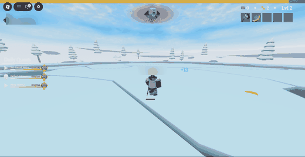
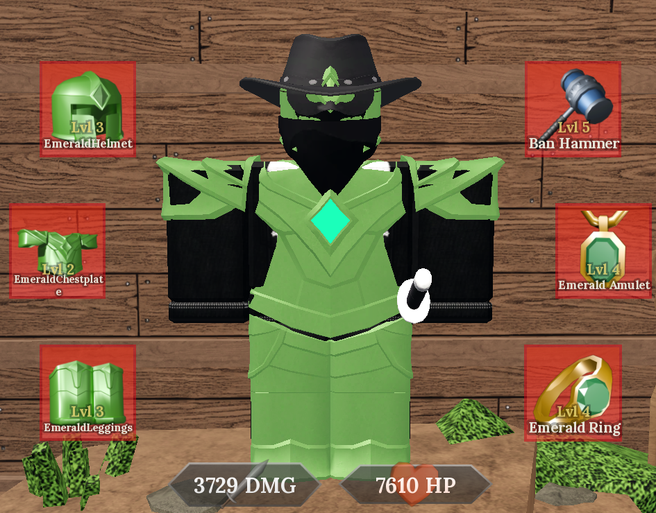
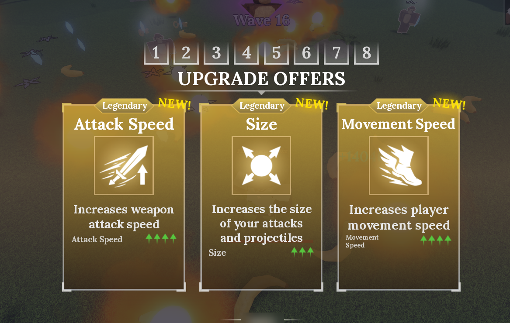
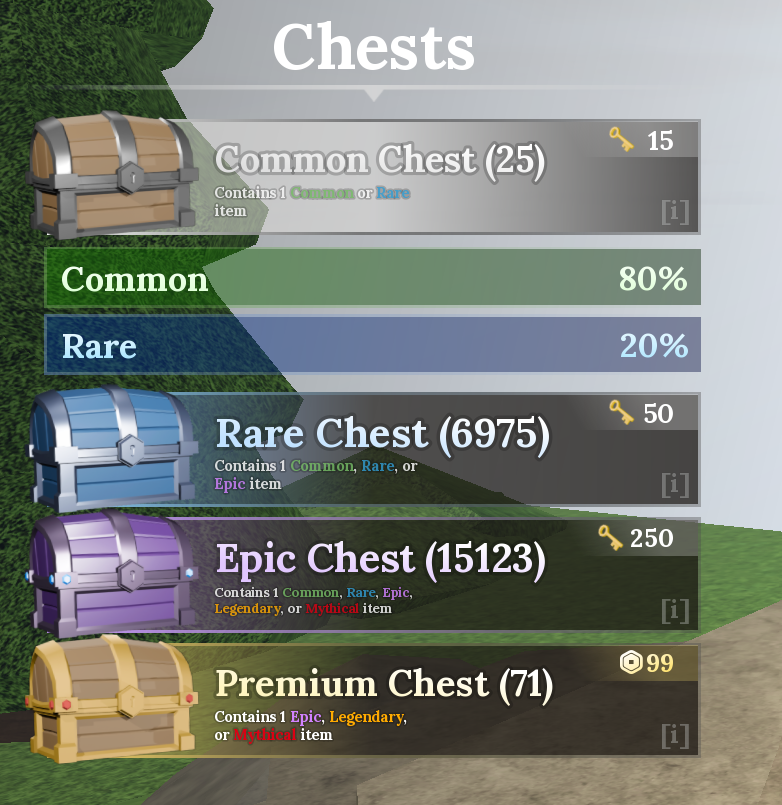
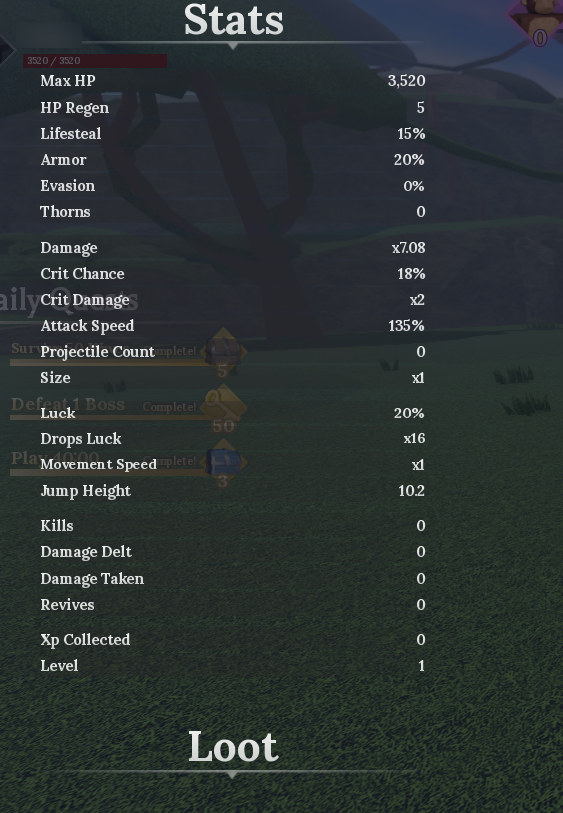

<div align="center">

# Final Swarm AFK Bot

**It plays [Final Swarm](https://www.roblox.com/games/99521272836282/Final-Swarm) while you do something else.**<br>
Reads the screen, picks your upgrades, restarts the run, farms all night.

[](https://www.python.org/downloads/)
[](#how-to-run-it)
[](https://www.roblox.com/games/99521272836282/Final-Swarm)
[](tests/)
[](docs/BUGS.md)
[](#known-bugs)
[](https://opencv.org/)
[](#license)
[](#want-to-help)
[](https://github.com/S1MS4/final-swarm-bot)


### 6 hours unattended &nbsp;•&nbsp; 892 upgrades picked &nbsp;•&nbsp; 19 runs &nbsp;•&nbsp; 0 keypresses

</div>

Final Swarm has no auto-play button why??? :c so this is my imitation of one.
Still in early beta, open source, fork it if you want to add to the project.

<div align="center">

⭐ **If this farms you a night's worth of chests, [star the repo](https://github.com/S1MS4/final-swarm-bot).** ⭐<br>
One click, costs you nothing, and it is the only way I can tell anyone uses this :D

</div>

## Contents

- [What it actually does](#what-it-actually-does)
- [Read this before you start](#read-this-before-you-start)
- [How to run it](#how-to-run-it)
- [Buttons and commands](#buttons-and-commands)
- [The build I use](#the-build-i-use)
- [What a long session gets you](#what-a-long-session-gets-you)
- [What each upgrade gives you](#what-each-upgrade-gives-you)
- [Changing what it picks](#changing-what-it-picks)
- [Tests](#tests)
- [Known bugs](#known-bugs)
- [To be technical i used](#to-be-technical-i-used)
- [Coming later](#coming-later)
- [Want to help](#want-to-help)

## What it actually does

- Takes the best card off a priority list you can edit yourself.
- Spends your 3 rerolls, weapons only, never stat cards.
- Handles dying, winning and restarting on its own - yayyy.
- Writes down what every upgrade gives, at every rarity, into `upgrades.json`.

## Read this before you start

Script is designed for no move farm so you should stack Lifesteal. That is why I
run the **Emerald Amulet**. Low Lifesteal build means it just dies, and that is
your build, not the bot :c

From what I've tested the most terms friendly approach is a non headless client
so rip ;-; just leave the computer on lil bro.

**I do not condone cheating.** Fun project to see if it was possible. It was.
Nothing has flagged my account so far, but "so far" is doing a lot of work in
that sentence. Use at your own risk.

## How to run it

No coding needed. Open **PowerShell** from your Start menu and paste each block.

**1. Install Python and Git.** Windows already has `winget`, so it does the
downloading, clicking and PATH for you:

```powershell
winget install -e --id Python.Python.3.12
winget install -e --id Git.Git
```

Now **close PowerShell and open it again**, otherwise it will not find them yet.

<details>
<summary>winget says it does not know that command?</summary>

Older Windows. Grab them by hand instead:
[Python 3.12](https://www.python.org/downloads/) (tick **Add Python to PATH**
during setup, that box matters) and [Git](https://git-scm.com/downloads),
defaults are fine.

</details>

**2. Get the files:**

```powershell
git clone https://github.com/S1MS4/final-swarm-bot.git
cd final-swarm-bot
```

Worth cloning rather than downloading a ZIP: when I push a fix you just type
`git pull`.

**3. Make a virtual environment and install what it needs:**

```powershell
python -m venv .venv
.\.venv\Scripts\Activate.ps1
pip install -r requirements.txt
```

A venv is just a folder holding this project's packages, so they cannot clash
with anything else on your PC and you can delete the whole thing by deleting the
folder. Python's own guide is
[here](https://docs.python.org/3/tutorial/venv.html) if you want the long version.

You will know it worked when your prompt starts with `(.venv)`. **Every new
terminal needs that middle line again** before you start the bot:

```powershell
.\.venv\Scripts\Activate.ps1
```

<details>
<summary>"running scripts is disabled on this system"?</summary>

PowerShell blocking the activate script. This allows it for that one window only,
then activate again:

```powershell
Set-ExecutionPolicy -Scope Process -ExecutionPolicy Bypass
.\.venv\Scripts\Activate.ps1
```

</details>

**4. Open Final Swarm and press PLAY.** You must already be **in a run**, it will
not press PLAY from the hub. Keep the game on your main monitor, not minimised.

Copy my setup: **not fullscreen**, a **maximized window** on **1920x1080**. It
measures the UI as a fraction of the window so other sizes should work, but this
one has the hours on it. Misread cards? Match my setup first.

**Turn the graphics down** so it grinds away quietly:

| Setting | Set it to |
|---------|-----------|
| FPS limit | 60 |
| In-game graphics | Potato |
| Roblox graphics quality | 1 bar (manual, not automatic) |

Potato also helps it read cards, fewer particles over the UI.

**5. Start it** (with `(.venv)` showing in your prompt):

```powershell
python -m swarmbot.bot
```

Just wait some time lil bro ur not in a rush, it's the python libraries that have
to load bruh.

Press `Shift + \` to stop. Two cards in a row, nobody at the keyboard:

<div align="center">



</div>

## Buttons and commands

| Key | Does |
|-----|------|
| `Shift + \` | Stops the bot. Works even if it is busy reading the screen. |
| `Ctrl + Shift + Q` | Also stops it, in case another app stole the first one. |

| Command | Does |
|---------|------|
| `python -m swarmbot.bot` | Farms forever |
| `python -m swarmbot.bot --max-runs 1` | Does one run and stops |
| `python -m swarmbot.bot --dry-run` | Decides but never clicks, good for watching it think |
| `python -m swarmbot.bot --strategy discover-first` | Sadly i ran this for a while till i got most of the upgrades, i think i got all of them idk, but for the future use this to update the list |
| `python -m tools.diagnose` | Tells you how the last session went |

## The build I use

Not maxed, before anyone asks :D

<div align="center">



</div>

| Slot | Item | Level |
|------|------|-------|
| Weapon | Ban Hammer | 5 |
| Helmet | Emerald Helmet | 3 |
| Chestplate | Emerald Chestplate | 2 |
| Leggings | Emerald Leggings | 3 |
| Amulet | Emerald Amulet | 4 |
| Ring | Emerald Ring | 4 |

**3,729 DMG and 7,610 HP** before in-run upgrades. All Emerald for the Lifesteal,
which is the only reason standing still works. The Amulet is the important one.
So no, you do not need a maxed account. If a level 2 chestplate can AFK it, yours
can.

I've noticed the best weapon order for me was **Ban Hammer, then Bananarang, then
Ninja Star**, Lightning Staff and Firestaff after. Ban Hammer first is not close,
it clears early waves before anything reaches you.

This is the priority list I've gathered, and it AFKs the final arena on Impossible
fine for me:

| Weapons, best first | Stat cards, best first |
|---|---|
| 1. Ban Hammer | 1. Multishot (Legendary only) |
| 2. Bananarang | 2. Luck |
| 3. Ninja Star | 3. Stand Strong |
| 4. Lightning Staff | 4. Demon Slayer |
| 5. Firestaff | 5. Projectile Count |
| 6. Revolver | 6. Armor |
| 7. Missile | 7. Health |
| 8. Axe | 8. Attack Speed |
| | 9. Damage |

**Only if nothing better is on screen:** Piercing, Freeze, Ricochet, Thorns.
**Actively avoid:** Movement Speed, you are not moving.

<div align="center">



</div>

## What a long session gets you

<div align="center">



</div>

**6,975 Rare and 15,123 Epic chests**, which is the part that makes it worth it.

I said 5 hours at first, then checked the bot's own logs and that undersells it.
Longest unattended run was **6 hours 23 minutes**, 11:50 to 18:13, no pause in
the log longer than 100 seconds. It had done **6h 13m** overnight before that.
Roughly 18 hours logged in total.

Out of that 6h 23m session, straight off the log:

| | |
|---|---|
| Upgrade cards picked | 892 |
| Runs restarted on its own | 19 |
| Times I touched the keyboard | 0 |

Runs go well past wave 120. The log stops at 99 because the wave reader cannot do
three digits yet, so ignore that number, the run carries on regardless.

Fair warning on the chests: the game tells the bot nothing about keys or chests,
so I cannot prove that pile came from that one session. The hours, picks and
restarts I can, the bot writes those down itself.

## What each upgrade gives you

The bot measured this itself, opening the Stats panel before and after each pick.
Real numbers off my screen, not guesses off a wiki. Blank means not offered at
that rarity yet.

| Upgrade | Common | Rare | Epic | Legendary |
|---------|--------|------|------|-----------|
| Health | +352 HP | +528 HP | +880 HP | +1760 HP |
| Damage | +0.2x | +0.4x | +0.5x | +0.8x |
| Attack Speed | +5% | +10% | +20% | +25% |
| Luck | +20% | +40% | +60% | +80% |
| Size | | +0.2x | +0.3x | +0.4x |
| Movement Speed | +0.1x | +0.2x | +0.3x | +0.4x |
| Regen | +1 HP/s | +2 HP/s | +3 HP/s | |
| Armor | | +2% | +6% | |
| Crit Chance | +2% | +5% | | |
| Lifesteal | | +0.1% | +0.5% | |
| Projectile Count | | | +1 | +2 |
| Thorns | | +10 | | |

Some cards give several stats at once:

| Upgrade | Rarity | Gives |
|---------|--------|-------|
| Power Trio | Legendary | +20% Attack Speed, +0.25x Damage, +704 HP |
| Giant's Strength | Epic | +0.25x Damage, +880 HP, +0.25x Size, **-0.2x Move Speed** |
| Soul of Swiftness | Epic | +20% Attack Speed, +0.2x Move Speed |
| Wind Blessing | Epic | +5% Evasion, +0.15x Move Speed, -0.1x Size |

**Skip these.** Blaze, Bolt, Ricochet, Piercing and Perilous Fervor only affect
one weapon, so they do almost nothing. Freeze is slightly okay, still not good.

**No number yet:** Multishot, Stand Strong, Demon Slayer. These do work, the
Stats panel just does not track them.

<details>
<summary>How it reads the numbers, and the panel it reads them from</summary>

It opens the Stats panel, snapshots it, closes it and parses the snapshot after,
so the game keeps running during the read. Upgrades already in the table get
skipped entirely.



Weapons seen so far: Ban Hammer, Bananarang, Ninja Star, Lightning Staff,
Firestaff, Revolver, Missile, Axe, Bow, Sword, Daggers, Spike Ball, Frost Walker.

</details>

## Changing what it picks

Open **`priority.txt`** in Notepad. Plain list, no code, higher gets picked first.

```ini
[weapons]        best first, if none show up the bot rerolls
[upgrades]       best first, add "@legendary" to only want it at that rarity
[low]            only when nothing better is on offer
[avoid]          only when it is the single card on screen
```

Unlisted cards sit between `[upgrades]` and `[low]`. `#` lines are ignored. Save,
restart the bot. A typo'd section falls back to the built-in list.

## Tests

**345 passing**, no game needed:

```powershell
python -m pytest tests/ -q
```

## Known bugs

4 open, 11 fixed, full list in [docs/BUGS.md](docs/BUGS.md).

| What you might notice | Bad? |
|-----------------------|------|
| Auto Skip turns itself off mid-run | No, it gets turned back on within 15s |
| Wave counter sticks around 99 past wave 100 | Display only, the run keeps going |
| It takes `Soul of Swiftness` despite avoiding Move Speed | Add it to `[avoid]` yourself |
| Weird window size breaks it | Maybe. This sh.. might break if you change the window to some weird format, but i tried to make the bot dynamically work on any idk haven't tested yet lul |

Found something new? Open an issue, screenshot helps.

## To be technical i used

- I've noticed OCR takes too long (about 900ms a read), so I did colour mapping
  instead. A few pixels takes 1ms, so it polls ~48 times a second instead of once.
- Rarity comes off the card's body colour, never the text. A font can misread, a
  colour cannot.
- OCR is only used for card names, and only once a colour check says it is worth
  reading.
- Hardest part: the UI is see-through, so the arena behind it shifts every colour
  reading. Same grey card reads `H39` on green, `H110` on blue. Notes in
  [docs/arena-portability.md](docs/arena-portability.md).
- Clicks use `SendInput` with curved, eased movement, and it checks the screen
  actually changed instead of assuming the click landed.
- OpenCV, numpy, mss, rapidocr, pywin32, pytest.

## Coming later

- A bot that works the best stats out mathematically and builds the priority list
  for you, instead of me guessing from feel.
- An item tier list with the real stats on each item.

## Want to help

Fork it, break it, send a pull request. Most useful right now: bug #1, and tuning
`priority.txt`. You do not need to understand the whole thing.

<div align="center">

### Star it if it farmed for you :D

[](https://github.com/S1MS4/final-swarm-bot)

It is free, and it is the only feedback I get.

</div>

## Disclaimer

Educational project. Automating a game probably breaks its terms of service and
could get your account banned. Not responsible for your account, use at your own
risk omegalul

## License

MIT
